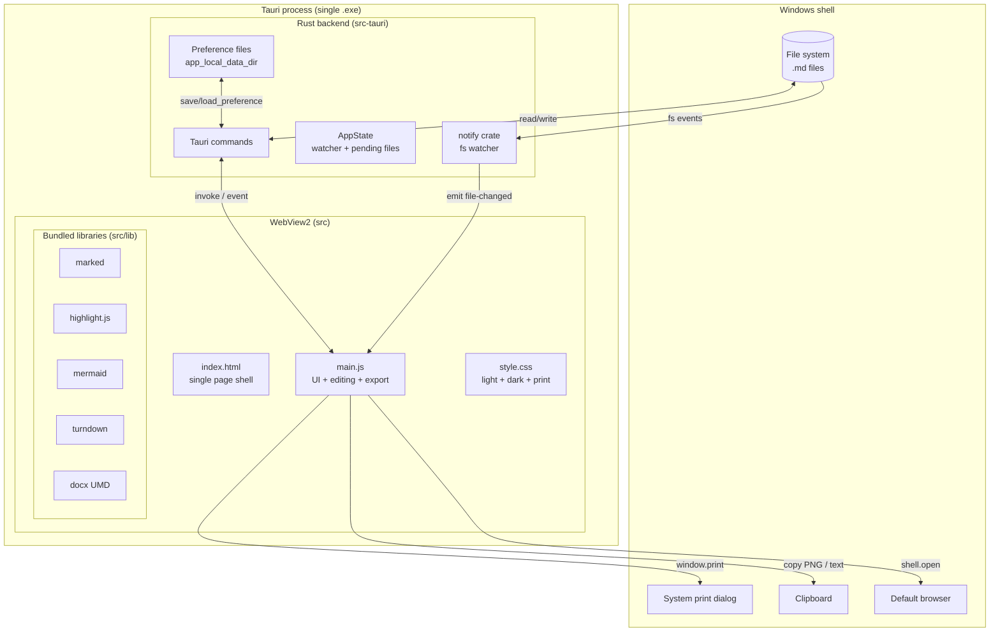
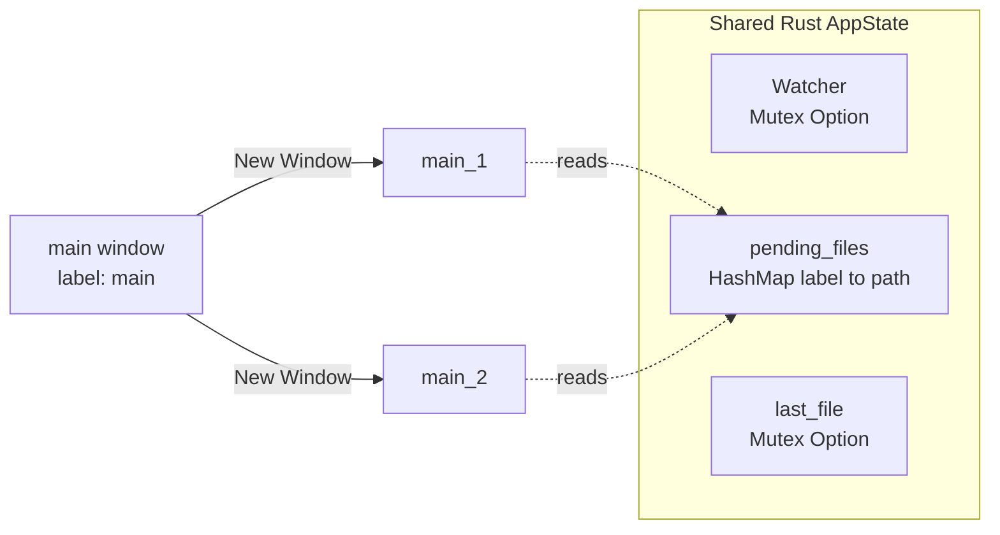
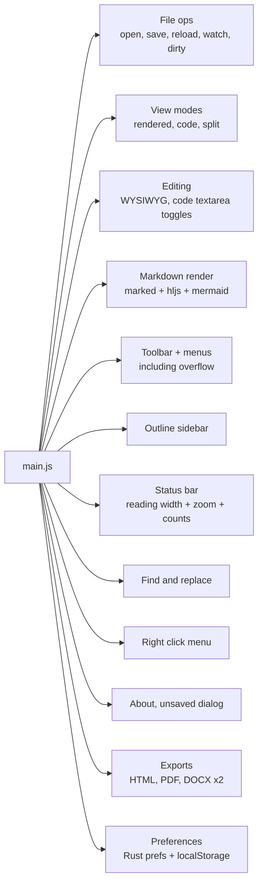
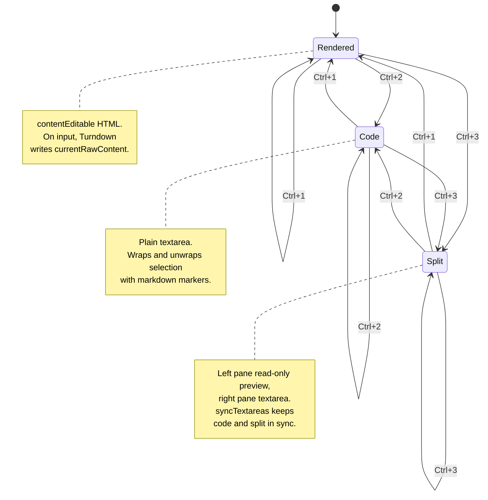
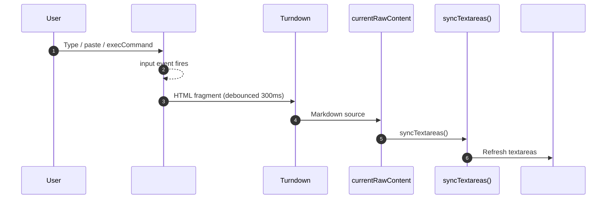
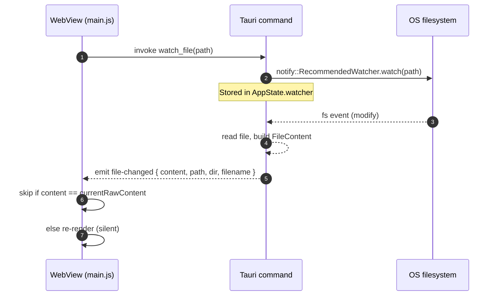
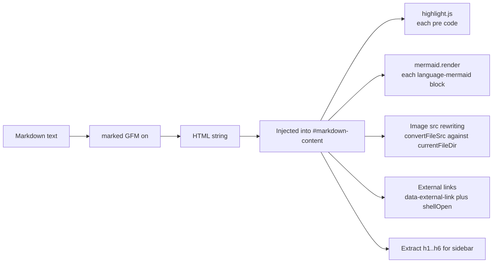
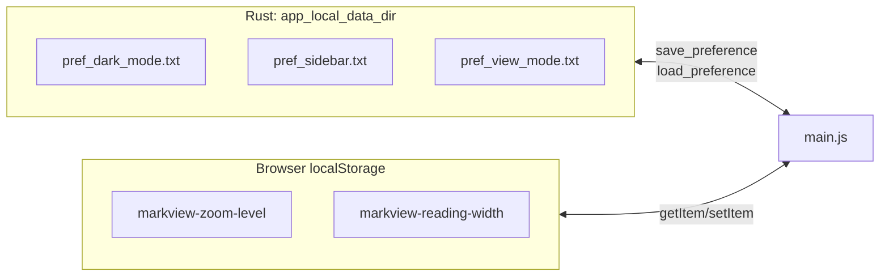
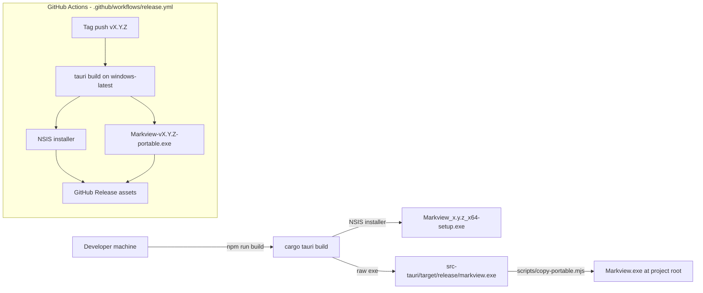

# Architecture

This document describes the internal architecture of **Markview** — how the
Rust backend, the vanilla-JS frontend, and the bundled libraries fit together
inside a single Tauri 2 application.

If you are looking for _what_ the app does, see [PRODUCT_SPEC.md](PRODUCT_SPEC.md).
This document is about _how_ it does it.

---

## 1. Stack overview

| Layer                | Technology                                     |
| -------------------- | ---------------------------------------------- |
| App shell            | Tauri 2.10.x (Rust + system WebView2)          |
| Backend              | Rust (edition 2021, `rustc >= 1.77.2`)         |
| Frontend             | Vanilla HTML + CSS + JavaScript (no framework) |
| Markdown parser      | `marked`                                       |
| Syntax highlighting  | `highlight.js`                                 |
| Diagrams             | `mermaid` 11.x (bundled locally)               |
| HTML → Markdown      | `turndown` (WYSIWYG round-trip)                |
| DOCX export          | `docx` UMD                                     |
| PDF export           | `window.print()` + dedicated print CSS         |
| HTML export          | DOM serialization + inlined stylesheets        |
| File watching        | Rust `notify` v6                               |
| Bundle target        | NSIS installer + portable `.exe`               |

The design intent is: **keep the frontend framework-free** so the whole
front-end can be re-hosted (Linux WebKitGTK, Android WebView) without a
rewrite, and **keep the Rust backend as a thin command layer** so most
behavior lives in the same place — `src/main.js`.

---

## 2. High-level component diagram



Every user action follows one of three loops:

1. **UI-only** — text formatting, view mode switch, zoom, dark mode. Handled
   entirely in the WebView by `main.js`; no Rust round-trip.
2. **File I/O** — open, save, watch. `main.js` invokes a Tauri command; Rust
   touches the filesystem and returns a result, sometimes followed by
   `file-changed` events.
3. **Export** — the WebView serializes DOM / generates bytes locally, base64
   encodes when needed, and asks Rust to write to disk (or asks the OS to
   print).

---

## 3. Process & window model

Markview runs as one Tauri process. Each window is a separate `WebviewWindow`
sharing the same Rust `AppState`.



- On startup, the frontend calls `get_cli_file` (returns `argv[1]` if it
  points at an existing `.md`). If empty, it calls `get_pending_file` — used
  when a new window is opened with a target file via `store_pending_file`.
- If the user opens a second file while one is loaded, a new window is
  spawned; if the current window is empty, the file replaces the current
  content.

---

## 4. Frontend structure

The whole UI lives in three files:

```
src/
├── index.html      single-page shell:
│                   menu bar, toolbar, sidebar, view containers,
│                   status bar, context menu, modals, panels
├── style.css       theme variables, layout, dark palette, print CSS
├── main.js         ~110 KB of behavior (no framework)
└── lib/            bundled 3rd-party libraries (loaded as scripts)
```

### 4.1 Logical modules inside `main.js`

`main.js` is a single file but is organized into functional groups:



Nothing in `main.js` imports anything — libraries are attached to `window`
by `<script>` tags in `index.html` (`marked`, `hljs`, `mermaid`, `TurndownService`,
`docx`, `window.__TAURI__`). This is intentional: no build step for the
frontend.

### 4.2 View mode state machine



Switching into Code / Split first calls `commitCodeBlockEditors()` to flush
any in-progress fenced-block textareas, then populates the textareas from
`currentRawContent` — this avoids Turndown round-tripping fenced blocks and
corrupting them.

### 4.3 WYSIWYG round-trip



Turndown is the source of truth going _back_ to markdown; `marked` is the
source of truth going _forward_ to HTML. Both directions are debounced by
300 ms to avoid burning CPU during fast typing.

---

## 5. Backend structure

The Rust code lives in `src-tauri/src/`:

```
src-tauri/src/
├── main.rs   thin entry — delegates to app_lib::run()
└── lib.rs    all Tauri commands + AppState + file watcher
```

### 5.1 Commands exposed to the frontend

| Command                | Purpose                                              |
| ---------------------- | ---------------------------------------------------- |
| `read_file`            | Read a `.md` file — returns content + dir + filename |
| `watch_file`           | Attach `notify` watcher, emit `file-changed`         |
| `unwatch_file`         | Detach the watcher                                   |
| `save_file`            | Write text file (used by Save / Save As / HTML)      |
| `save_base64_file`     | Write binary file from base64 (used by DOCX)         |
| `store_pending_file`   | Stash a file path keyed by window label              |
| `get_pending_file`     | Consume the stash for the current window             |
| `get_cli_file`         | Return `argv[1]` when it is an existing `.md`        |
| `save_preference`      | Persist a keyed string in `app_local_data_dir`       |
| `load_preference`      | Read that string back                                |
| `get_last_file`        | (Unused by frontend — see Known Gaps)                |
| `quit_app`             | `std::process::exit(0)`                              |

### 5.2 File watch flow



The `skip if equal` check on the frontend is critical — without it, Save
would trigger a modify event that would re-render the just-saved content
and cause a loop.

---

## 6. Rendering pipeline



- **GFM extensions** (`marked` with `gfm: true`): tables, task lists, autolinks, strikethrough.
- **Mermaid** is initialized once with `{ startOnLoad: false, securityLevel: 'loose' }`
  and re-initialized on dark-mode toggle.
- **Image paths**: relative paths resolve against the opened file's directory
  through Tauri's `convertFileSrc`; absolute `http/https/data:` URLs pass through.
- **External links** get `data-external-link="true"` so clicks are intercepted
  and routed through `shellOpen` (system browser).

---

## 7. Export pipelines

```mermaid
flowchart TB
    Content[Rendered DOM + currentRawContent]

    Content --> HTMLBox[HTML export]
    Content --> PDFBox[PDF export]
    Content --> DOCXMD[DOCX Markdown Style]
    Content --> DOCXWord[DOCX Word Style]

    HTMLBox -->|serialize + inline stylesheets<br/>+ include mermaid script| SaveFile1[save_file]

    PDFBox -->|@media print CSS<br/>hide chrome, keep #rendered-view| WinPrint[window.print]

    DOCXMD -->|docx UMD<br/>Heading typography = HTML| BuildDocx1[Base64 docx bytes]
    DOCXWord -->|docx UMD<br/>Calibri Light, blue H1/H2, italic H4| BuildDocx2[Base64 docx bytes]

    BuildDocx1 --> SaveFile2[save_base64_file]
    BuildDocx2 --> SaveFile3[save_base64_file]
```

- **HTML** is _self-contained_ — every stylesheet in the document is inlined
  and the mermaid runtime is embedded so the exported page renders + retains
  its toggle/copy buttons offline.
- **PDF** relies on the OS print dialog; the print CSS hides menu bar, toolbar,
  status bar, sidebar, and mermaid toolbars, and constrains the page to
  `#rendered-view` full width.
- **DOCX (Markdown / Word Style)** share the same node-mapping logic; they
  differ in heading typography only. Both rasterize mermaid SVGs to PNG (canvas
  round-trip), then also append the raw source as a fenced-code paragraph.

---

## 8. Persistence

Two persistence layers, chosen per the domain of the setting.



Rationale: settings that outlive the WebView storage (theme, layout, view
mode) are persisted in Rust so users don't lose them across WebView cache
clears. Zoom & reading-width are cheap UI state and live in `localStorage`.

Not persisted (by design): current file path, find/replace history, cursor
position, scroll position.

---

## 9. Build & release pipeline



- **Local dev**: `npm run build` runs `tauri build`, then
  `scripts/copy-portable.mjs` copies the built `markview.exe` to the project
  root as `Markview.exe`. That root copy is gitignored — it exists so the
  developer can hand-share the current build.
- **CI**: tagging `vX.Y.Z` triggers Windows build, uploads _both_ the NSIS
  installer and the renamed portable exe as release assets.

---

## 10. Non-goals & design constraints

Explicitly out of scope (so please don't PR these — see also `DO NOT BUILD`
in project docs):

- File-tree sidebar (outline sidebar only)
- Tabs in a single window (multi-window is the model)
- Auto-save (Save is explicit)
- Math / LaTeX
- Spell check
- Any in-app settings window
- Tauri `webview.setZoom()` (all zoom is frontend CSS `zoom`)
- Splitting a toolbar group across visible bar and overflow

Design constraints worth restating for contributors:

- **Frontend stays framework-free.** No React, Vue, Svelte, or build step.
- **Bundled libraries only.** No CDN references; everything ships in `src/lib/`.
- **Rust code stays thin.** File I/O, watcher, preferences, base64 write.
  Rendering & editing logic belong in the frontend.
- **Portable first.** Any feature that requires an installer-only side effect
  (registry writes, background services) is out of scope.

---

## 11. Known gaps

Tracked so future work doesn't re-introduce them:

1. `get_last_file` + `last_file.txt` writing exist on the Rust side but the
   frontend never calls `get_last_file` on startup — wire it up or delete it.
2. `lib/html-docx.js` is bundled but the current DOCX exporter uses `docx`
   (`lib/docx.umd.js`). Removing html-docx.js would shrink the bundle.
3. Version string is inconsistent: `Cargo.toml` / `tauri.conf.json` say
   `0.1.0`; the About modal says `0.2.0`. Pick one source of truth (see
   [CHANGELOG.md](CHANGELOG.md) for the release notes).
