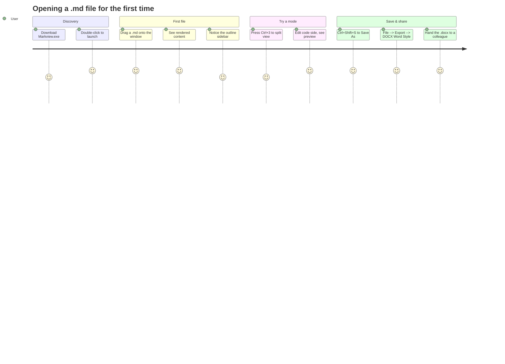
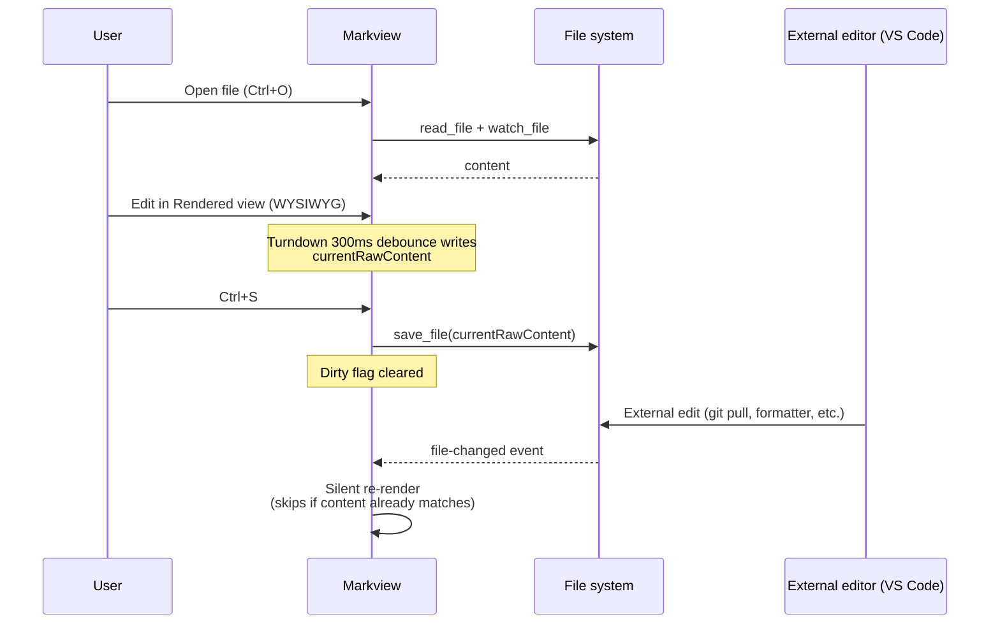
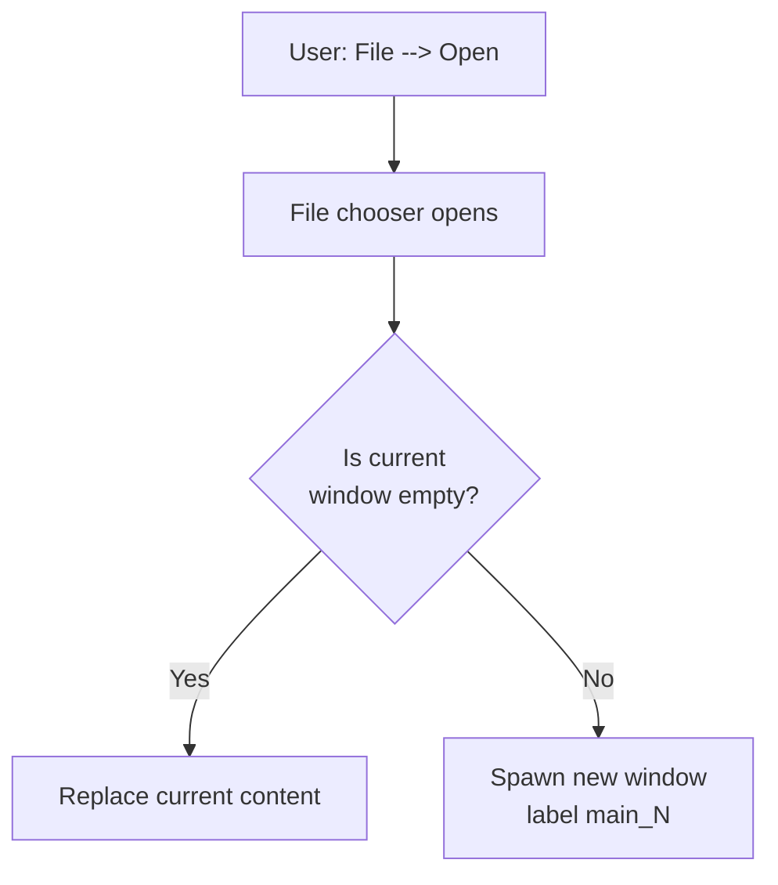
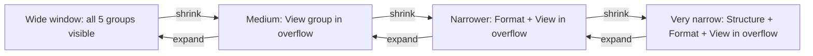

# Product Specification

**Product:** Markview — Portable Markdown Editor for Windows
**Version:** 0.2.0
**Status:** Released

This document describes _what_ Markview does and _for whom_. For _how_ it is
built, see [ARCHITECTURE.md](ARCHITECTURE.md).

---

## 1. Vision

Most Markdown editors are one of three things:

1. **Web apps** that require you to trust a browser tab with your notes.
2. **Heavy IDE plugins** wrapped around a full editor you didn't ask for.
3. **Installer-only desktop apps** that plant themselves in Program Files
   and stay there.

Markview is none of those. It is a **single portable `.exe`** that opens
`.md` files, renders them beautifully, lets you edit them with three view
modes, and exports to HTML / PDF / DOCX — with no installer, no telemetry,
no account, and no internet dependency at runtime.

**Design principle:** _do less, better._ Every feature in this spec ships in
under 200 KB of frontend code and a thin Rust shell.

---

## 2. Target users

| Persona                     | Why they use Markview                                                                     |
| --------------------------- | ----------------------------------------------------------------------------------------- |
| **Documentation writers**   | Need a portable, distraction-free renderer with accurate GFM + Mermaid + code highlight.  |
| **Software engineers**      | Read `README.md` / spec files without opening the whole IDE. Edit and re-export inline.    |
| **Analysts / consultants**  | Need to hand a rendered doc (DOCX or PDF) to non-technical stakeholders.                  |
| **Students & researchers**  | Want a Markdown-native workflow that produces Word-shaped output for submission.          |
| **IT / support staff**      | Distribute a single `.exe` that "just works" on locked-down corporate Windows machines.   |

Non-user (explicitly): people who want a note-taking system with tags, backlinks,
vaults, or sync. Markview is a **file editor**, not a knowledge base.

---

## 3. Platform & delivery

- **Primary target:** Windows 11 (WebView2 required — preinstalled on Win 11).
- **Also runs on:** Windows 10 with WebView2 runtime installed.
- **Distribution:** single portable `Markview.exe` (~10-20 MB depending on
  Tauri/Rust versions), no installer required. NSIS installer is also
  provided for users who prefer Start Menu integration.
- **Roadmap:** Linux (WebKitGTK) and Android (Tauri mobile) — port
  requirements in [README.md](README.md).

---

## 4. User journeys

### 4.1 First-time open



### 4.2 Iterative editing session



### 4.3 Opening a second file



This is the model: **one window per document**. No tabs.

---

## 5. Feature matrix

### 5.1 File operations

| Feature           | Shortcut       | Notes                                                        |
| ----------------- | -------------- | ------------------------------------------------------------ |
| New               | `Ctrl+N`       | Clears editor. Dirty-guard fires if needed.                  |
| New Window        | Menu           | Independent Tauri window with its own state.                 |
| Open              | `Ctrl+O`       | Filters to `.md`. Opens in new window if current has content.|
| Save              | `Ctrl+S`       | Writes to known path or falls through to Save As.            |
| Save As           | `Ctrl+Shift+S` | Reattaches file watcher on new path.                         |
| Reload            | `Ctrl+R`       | Re-reads from disk, discards unsaved edits (no confirm).     |
| Quit              | `Ctrl+Q`       | Unsaved-changes guard.                                       |
| Drag-and-drop     | —              | `.md` files onto the window trigger open with dirty-guard.   |
| CLI argument      | —              | `Markview.exe file.md` opens the file on launch.             |
| Live reload       | —              | External edits detected via `notify`; UI re-renders silently.|

### 5.2 View modes

| Mode         | Shortcut | Editable? | Source of truth              |
| ------------ | -------- | --------- | ---------------------------- |
| **Rendered** | `Ctrl+1` | Yes (WYSIWYG via `contentEditable`) | HTML → Markdown via Turndown |
| **Code**     | `Ctrl+2` | Yes (raw textarea) | Textarea contents            |
| **Split**    | `Ctrl+3` | Yes (right pane textarea) | Textarea contents            |

The current mode persists across launches.

### 5.3 Formatting actions

Every formatting action works in all three modes, but with mode-appropriate
mechanics:

| Action          | Rendered (WYSIWYG)              | Code / Split (textarea)                     |
| --------------- | ------------------------------- | ------------------------------------------- |
| Bold            | `execCommand('bold')`           | Toggle `**...**` around selection           |
| Italic          | `execCommand('italic')`         | Toggle `*...*`                              |
| Underline       | `execCommand('underline')`      | Toggle `<u>...</u>`                         |
| Strikethrough   | `execCommand('strikeThrough')`  | Toggle `~~...~~`                            |
| Inline code     | Wrap selection in `<code>`      | Toggle `` `...` ``                          |
| Hyperlink       | Prompt for URL, wrap selection  | Insert `[text](url)`                        |
| Heading H1–H6   | `formatBlock`                   | Replace `#{1,6}` prefix on current line     |
| Increase level  | Walk up DOM, shift heading tag  | Add `#`, clamp 1–6                          |
| Decrease level  | Walk up DOM, shift heading tag  | Remove `#`, clamp 1–6 (0 = plain paragraph) |
| Clear format    | `removeFormat` + `<p>`          | Strip inline / heading markers on selection |
| Ordered list    | (via toolbar / menu)            | Prefix each selected line with `N. `        |
| Bullet list     | (via toolbar / menu)            | Prefix each selected line with `- `         |
| Insert Table    | Insert HTML table               | Insert GFM table template                   |
| Insert Code Block | Insert `<pre><code>`          | Insert fenced ` ``` ` block                 |
| Insert Mermaid  | Insert mermaid `<div>`          | Insert ` ```mermaid ` block                 |
| Insert HR       | `<hr>`                          | Insert `\n---\n`                            |

**Undo / redo** uses the browser's native per-surface history. After a
WYSIWYG undo/redo, Turndown re-runs (debounced) so `currentRawContent`
stays in sync.

### 5.4 Find & Replace (`Ctrl+H`)

- Panel with find + replace fields, prev/next, replace / replace all.
- Match: **case-insensitive substring** (not regex).
- `Enter` in the find field jumps to next.
- `Esc` closes the panel.
- Match counter shows `N of M`.

### 5.5 Outline sidebar

- Extracts H1–H6 from the rendered document.
- Click a heading → smooth scroll to it in the content area.
- The heading closest to the viewport top is highlighted (accent left border + text color).
- Toggle: **`Ctrl+\` (backslash)** — not `Ctrl+B`, which is Bold.
- Widths: expanded 260 px / collapsed 40 px rail. Persists across launches.

### 5.6 Toolbar (Word-style ribbon)

Five groups, left to right:

1. **File** — Open, New, Save, Save As, Export HTML, Export PDF, Export DOCX ×2
2. **Edit** — Undo, Redo, Cut, Copy, Paste, Find & Replace
3. **Structure** — H1–H6, Clear Format, Ordered / Bullet List
4. **Format** — Bold, Italic, Underline, Strike, Inline Code, Hyperlink
5. **View** — Toggle Sidebar, Rendered / Code / Split view

**Responsive overflow (Word-style `»`):**



- Groups collapse **as a unit** — never split between visible bar and overflow.
- Collapse priority: rightmost first (View → Format → Structure → Edit → File).
- When everything fits, the `»` chevron is hidden entirely.

### 5.7 Status bar

Fixed 32 px, does **not** scale with zoom.

**Left:** filename · `Ln X, Col Y` (code/split modes) · `N words`
**Right:** Reading Width group · vertical divider · Zoom group

#### Reading Width (three presets)

| Button                | max-width | Persisted value |
| --------------------- | --------- | --------------- |
| Optimal Reading       | `65ch`    | `optimal`       |
| Fit to Width          | `100%`    | `fit`           |
| **Default View** ⭐   | `860px`   | `default`       |

Default on first launch is **Default View**.

#### Zoom (independent of Reading Width)

- Range **50–300 %**, step 5 %.
- Controls: `−` / slider / `+` / clickable percentage input.
- Keyboard: `Ctrl+=` / `Ctrl+-` (±10 %), `Ctrl+0` (reset), `Ctrl+MouseWheel` (±5 % per tick).
- Applied via CSS `zoom` on `#content-area` only. Menu, toolbar, sidebar, status
  bar never scale.
- Mermaid SVGs scale visually with zoom without re-rendering.

### 5.8 Dark mode

- Toggle: View → Toggle Dark Mode or `Ctrl+Shift+D`.
- Applies `.dark` class to `<body>`; CSS variables swap the palette.
- Mermaid re-initializes with `theme: 'dark'` and content re-renders when the mode changes.
- Persists across launches.

### 5.9 Right-click context menu

Appears **only** on editable surfaces (rendered content or textareas).

Contents:

- Bold / Italic / Underline / Strikethrough / Inline Code
- Heading submenu (H1–H6)
- Clear Format
- Insert submenu (Table / Mermaid / Code Block / Horizontal Line)
- Cut / Copy / Paste

### 5.10 Exports

| Format                  | Fidelity notes                                                                    |
| ----------------------- | --------------------------------------------------------------------------------- |
| **HTML**                | Self-contained. All stylesheets inlined. Mermaid script bundled — exported file stays interactive offline. Respects current dark mode. |
| **PDF**                 | Print CSS hides chrome; system print dialog picks the printer / "Save as PDF".    |
| **DOCX (Markdown Style)** | Uses HTML-rendering typography. H1/H2 have bottom borders. Body font matches HTML. |
| **DOCX (Word Style)**     | Calibri Light headings, accent blue H1/H2, italic H4, Calibri body. Looks like a native Word doc. |

Both DOCX modes support: tables, nested ordered/unordered lists (up to 9 levels),
blockquotes, shaded code blocks, embedded images (when resolvable), mermaid
(rasterized SVG → PNG + fenced source), and hyperlinks.

### 5.11 Persistence

| Setting             | Store             | Key                              |
| ------------------- | ----------------- | -------------------------------- |
| Dark mode           | Rust (app data)   | `pref_dark_mode.txt`             |
| Sidebar state       | Rust (app data)   | `pref_sidebar.txt`               |
| View mode           | Rust (app data)   | `pref_view_mode.txt`             |
| Zoom level          | `localStorage`    | `markview-zoom-level`            |
| Reading width       | `localStorage`    | `markview-reading-width`         |

**Not persisted** (by design): current file path, find/replace history,
cursor position, scroll position.

---

## 6. UX rules

These are load-bearing and should not be violated in future changes:

- **Zoom is independent of reading width.** They combine, they do not replace each other.
- **Status bar never scales with zoom.** It always reads 32 px, 12 px font.
- **Save is always explicit.** No auto-save. Ever.
- **File watcher never causes a loop.** The frontend suppresses re-render when
  disk content already equals `currentRawContent`.
- **Groups in the toolbar collapse as a unit.** Never split.
- **External links open in the system browser**, not in-app.
- **Mermaid does not re-render on zoom or reading-width change.** SVG auto-scales.

---

## 7. What we deliberately do NOT build

Explicitly out of scope. These have been considered and rejected to keep the
product tight:

- **In-app settings window.** Configuration is exposed inline (Reading Width, Zoom, Dark Mode).
- **File-tree sidebar.** The outline sidebar IS the sidebar.
- **Tabs inside a single window.** Multi-document = multi-window.
- **Math / LaTeX rendering.** Use one of the many web-based math renderers.
- **Footnotes / YAML front matter special display.** Rendered as-is via GFM.
- **Spell check.** Use the OS-level spell check where the WebView surfaces it.
- **Typewriter / focus mode.**
- **Auto-save.**
- **Word / character goals.**
- **Cloud sync, accounts, telemetry.** Markview is a local file editor.
- **Custom Reading Width beyond Optimal / Fit / Default.**

---

## 8. Success criteria

Markview is considered successful if:

1. A user can open, edit, save, and export a `.md` file **without reading any docs**.
2. The rendered output looks _better_ than GitHub's default web renderer.
3. The DOCX export can be handed to a non-technical Word user without visible
   Markdown artifacts.
4. The `.exe` runs on a stock Windows 11 machine with no admin rights and no install.
5. Zero telemetry, zero network calls at runtime.

---

## 9. Roadmap

See [README.md § Roadmap](README.md#roadmap-linux-and-android-ports) for the
Linux and Android ports. Feature-wise, the shortlist under consideration
(not committed):

- Configurable syntax-highlight theme
- Recent files list in the File menu
- Multi-file "workspace" view (read-only, sidebar file tree) — _if_ it can be
  added without violating §7
- Signed / notarized Windows exe

Anything not in this shortlist is out of scope by default.
