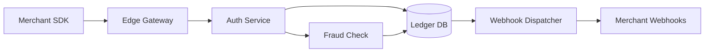

# Q3 Product Review: Payments Platform

_Prepared by: Platform Engineering · Draft v0.3_

> This document is used by the MarkView README to showcase what a real
> rendered Markdown file looks like inside the app. The content is fictional.

## Executive summary

Our payments platform served **12.4 M** transactions in Q3, up **18 %** QoQ.
The critical objective for the quarter was to reduce **p99 checkout latency**
below **250 ms** end-to-end. We hit **231 ms** in week 11 and have held that
target for the last three weeks.

Three items require executive attention:

1. Dispute-processing SLA breach in September — resolved, retrospective attached.
2. Vendor cost projection for Q4 (see § 4).
3. Team hiring plan — two open reqs still unfilled.

## 1. Traffic & performance

| Metric              |     Q2 2026 |     Q3 2026 | Δ QoQ    |
| ------------------- | ----------: | ----------: | :------- |
| Transactions        |    10.5 M   |    12.4 M   | **+18 %** |
| p50 latency         |     108 ms  |      94 ms  | −13 %    |
| p99 latency         |     287 ms  |     231 ms  | **−20 %** |
| Success rate        |    99.94 %  |    99.97 %  | +0.03 pp |
| Dispute rate        |     0.21 %  |     0.19 %  | −0.02 pp |

### 1.1 Where the p99 gains came from

- Replaced the legacy `AuthService` synchronous fan-out with a coroutine-based
  pipeline (see PR #4821).
- Enabled connection pooling on the fraud-check downstream (`fraud-svc`).
- Moved 3rd-party card-network token exchange behind our edge cache.

## 2. Architecture in one diagram



## 3. Sample handler

The pattern below is the one all new payment paths must follow:

```python
async def process_payment(request: PaymentRequest) -> PaymentResult:
    async with tracer.span("process_payment") as span:
        span.set_attribute("amount", request.amount)

        auth = await auth_service.authorize(request)
        if not auth.ok:
            return PaymentResult.declined(auth.reason)

        fraud = await fraud_service.score(request, auth)
        if fraud.score > FRAUD_THRESHOLD:
            metrics.increment("payment.fraud_blocked")
            return PaymentResult.blocked()

        return await ledger.commit(auth, fraud)
```

Key points: **structured tracing**, _no_ blocking calls, and the fraud score
threshold is loaded from config, not hard-coded.

## 4. Q4 vendor cost projection

- **Card network fees** — projected `$1.42 M` (flat QoQ)
- **Fraud provider** — projected `$310 K` (up **22 %**; renegotiation in progress)
- **Infrastructure** — projected `$185 K` (down 8 % after the coroutine rewrite)

## 5. Action items

- [x] Ship coroutine pipeline behind flag `pay.coroutine.enabled`
- [x] Backfill 90 days of edge-cache metrics
- [ ] Close two open reqs (Senior SRE, Payments PM)
- [ ] Sign renewed contract with fraud vendor by **October 31**

---

_Questions? Ping `#payments-platform` on Slack or reply on the PR._
