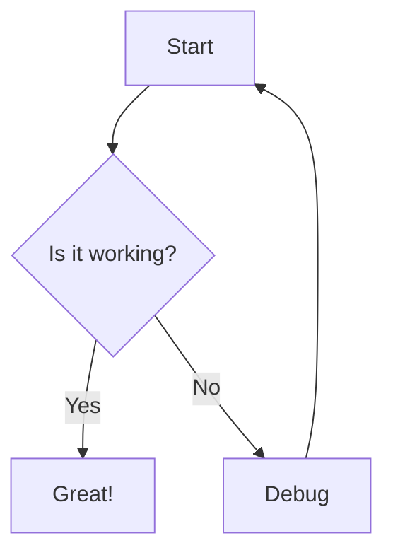

# Markview Test Document

## Text Formatting

This is a **bold** text, *italic* text, ~~strikethrough~~ text, and `inline code`.

## Lists

### Unordered
- Item one
- Item two
  - Nested item
- Item three

### Ordered
1. First
2. Second
3. Third

## Blockquote

> This is a blockquote.
> It can span multiple lines.

## Code Block

```javascript
function hello(name) {
  console.log(`Hello, ${name}!`);
  return true;
}
```

```python
def fibonacci(n):
    if n <= 1:
        return n
    return fibonacci(n-1) + fibonacci(n-2)
```

## Table

| Name | Language | Stars |
|------|----------|-------|
| React | JavaScript | 200k |
| Vue | JavaScript | 200k |
| Svelte | JavaScript | 70k |

---

## Mermaid Diagram



## Links and Images

[Visit GitHub](https://github.com)

## Heading Levels

### H3 Heading
#### H4 Heading
##### H5 Heading
###### H6 Heading

That's all folks! This document has many words to test the word counter in the status bar.
